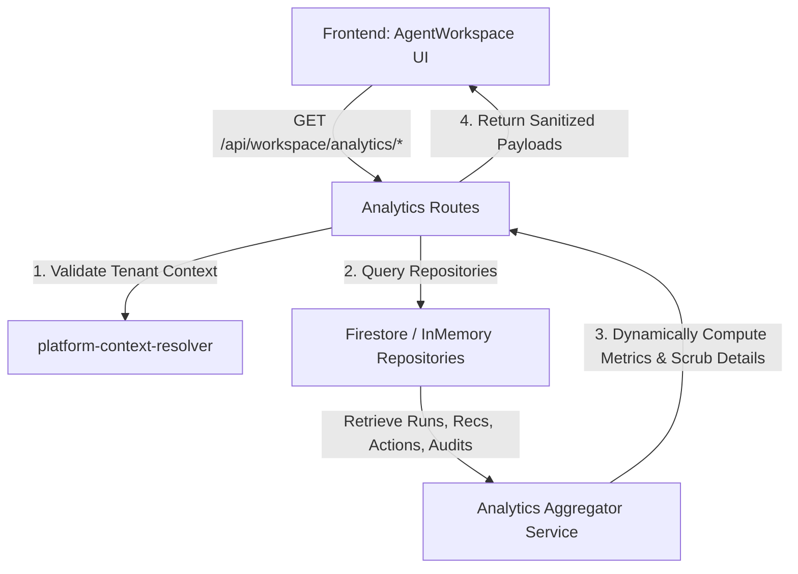

# Implementation Plan — Phase 10.10: Multi-Agent Workspace Analytics & Operational Visibility

This phase builds **Analytics, Operational Visibility, and Safe Operational Trace/Timeline capabilities** on top of the Phase 10.9 multi-agent workspace foundation. It empowers merchants and administrators to monitor agent performance, recommendation volume, proposed actions, approval conversions, and historical activity trends securely under strict tenant isolation and sanitization boundaries.

---

## User Review Required

> [!IMPORTANT]
> **Read-Only Analytics Scope & Mutation Boundaries**:
> - Phase 10.10 is **strictly read-only** for analytics, telemetry aggregation, and timeline visualization.
> - Under no circumstances do any of the proposed endpoints trigger writes, updates, executions, or mutations to the Shopify catalog, storefront, or Softify workspace state.
> - The existing hardened Tool Gateway remains the only mutation execution boundary.

> [!WARNING]
> **Strict Operational Scrubber & Telemetry Isolation**:
> - **Zero raw prompts, provider completions, raw model reasoning, or chain-of-thought streams will be persisted or exposed in API payloads.**
> - **Zero raw tool arguments, raw Shopify API responses, tokens, secrets, or PII will be returned or logged.**
> - The timeline trace maps existing audit events dynamically and filters all outgoing records using an allowlist-only mapper.

> [!CAUTION]
> **Tenant Scoping Enforcement**:
> - All analytics endpoints must resolve the tenant context via the established shop validation or organization check parameters. 
> - Front-end organizationId headers/query params **must not be trusted blindly** when a shop parameter exists. The backend must cross-reference and reject mismatched tenant scopes with HTTP 403 Forbidden.

---

## Open Questions

- **Do we need new collections for analytics or metrics?**
  - *Proposed Decision*: **No.** In order to prevent data duplication, sync lag, and index-overhead bloat, all analytics endpoints will query the existing `agent_runs`, `recommendations`, `proposed_actions`, `merchant_approvals`, and `agent_audit_logs` collections, performing lightweight, high-performance in-memory aggregations and derivations.
- **Should historical trends cover a fixed window or custom dates?**
  - *Proposed Decision*: Endpoints will accept optional `dateFrom` and `dateTo` parameters, defaulting to a rolling 30-day window.

---

## Proposed Changes



### A. Current Architecture Fit

Phase 10.10 seamlessly integrates with the Phase 10.9 foundation:
- **Repositories**: We will reuse `agentRuns`, `recommendations`, `proposedActions`, `approvals`, and `audit` repositories wired into `repository-provider.ts`.
- **Routes**: We will extend the existing `src/server/routes/analytics.routes.ts` file, where `/api` is already mounted.
- **Service Integration**: We will introduce a new read-only `src/server/services/workspace-analytics.service.ts` to coordinate fetching and aggregating data, avoiding duplicated filter logic.
- **Context Resolver**: We will reuse `normalizeShopDomain` and the `StoreConnection` database lookup rules from Phase 10.9 to resolve organization context.

---

### B. Analytics Data Sources

No new collections will be created. Analytics are fully derived from:
1. `agent_runs`: Statuses (`COMPLETED`/`FAILED`/`BLOCKED`), modes, start/finish times, and counts.
2. `recommendations`: Volumes, status distributions, risk levels, and impact levels.
3. `proposed_actions`: Execution modes, status distributions, and types.
4. `merchant_approvals` (`approvals`): Bridge conversion details (decisions, execution status, attempt counts).
5. `agent_audit_logs` (`audit`): existing sanitized audit lifecycle events mapped into a safe operational timeline.

---

### C. Analytics API Design

All endpoints are mounted on the `analytics.routes.ts` router.

#### 1. `GET /api/workspace/analytics/summary`
- **Purpose**: High-level metric summary cards for the workspace dashboard.
- **Query Parameters**:
  - `shop` (string, optional - resolves tenant)
  - `organizationId` (string, optional - resolves tenant)
  - `dateFrom` (string, ISO-8601, optional)
  - `dateTo` (string, ISO-8601, optional)
- **Response Shape**:
  ```json
  {
    "ok": true,
    "summary": {
      "totalAgentRuns": 45,
      "failedRuns": 3,
      "blockedRuns": 1,
      "totalRecommendations": 80,
      "openRecommendations": 25,
      "dismissedRecommendations": 55,
      "totalProposedActions": 30,
      "draftActions": 12,
      "approvalRequestedActions": 8,
      "approvedActions": 6,
      "rejectedActions": 2,
      "executedActions": 4,
      "dismissedActions": 2,
      "approvalConversionRate": 75.0,
      "activeAgentsCount": 4
    }
  }
  ```

#### 2. `GET /api/workspace/analytics/agent-runs`
- **Purpose**: Run statistics, agent breakdowns, and trend sequences over time.
- **Query Parameters**: Same tenant & date filters + `agentId`, `status`.
- **Response Shape**:
  ```json
  {
    "ok": true,
    "runs": [
      {
        "agentId": "product_intelligence_agent",
        "totalRuns": 15,
        "completed": 13,
        "failed": 2,
        "blocked": 0,
        "averageDurationMs": 1450,
        "recommendationsGenerated": 40,
        "actionsGenerated": 20
      }
    ],
    "trends": [
      {
        "date": "2026-05-25",
        "runCount": 5,
        "failedCount": 1
      }
    ]
  }
  ```

#### 3. `GET /api/workspace/analytics/recommendations`
- **Purpose**: Count breakdown by status, type, risk, and impact levels.
- **Query Parameters**: Tenant & date filters + `agentId`, `status`, `riskLevel`, `impactLevel`.
- **Response Shape**:
  ```json
  {
    "ok": true,
    "breakdown": {
      "byStatus": { "OPEN": 25, "DISMISSED": 55 },
      "byRisk": { "LOW": 30, "MEDIUM": 40, "HIGH": 10 },
      "byImpact": { "LOW": 20, "MEDIUM": 50, "HIGH": 10 },
      "byType": { "TAXONOMY": 45, "SEO": 35 },
      "byAgent": { "content_agent": 35, "seo_aeo_agent": 45 }
    }
  }
  ```

#### 4. `GET /api/workspace/analytics/proposed-actions`
- **Purpose**: Count breakdown by status and execution modes.
- **Query Parameters**: Tenant & date filters + `agentId`, `status`, `executionMode`, `riskLevel`.
- **Response Shape**:
  ```json
  {
    "ok": true,
    "breakdown": {
      "byStatus": { "DRAFT": 12, "APPROVAL_REQUESTED": 8, "APPROVED": 6, "REJECTED": 2, "EXECUTED": 4, "DISMISSED": 2 },
      "byExecutionMode": { "DRAFT_ONLY": 5, "APPROVAL_REQUIRED": 20, "NOT_EXECUTABLE": 5 },
      "byRisk": { "LOW": 10, "MEDIUM": 15, "HIGH": 5 },
      "byAgent": { "content_agent": 22, "product_intelligence_agent": 8 }
    }
  }
  ```

#### 5. `GET /api/workspace/analytics/approval-conversion`
- **Purpose**: Calculate conversion percentages through the proposed action pipeline.
- **Query Parameters**: Tenant & date filters + `agentId`.
- **Response Shape**:
  ```json
  {
    "ok": true,
    "conversion": {
      "totalProposed": 30,
      "totalApprovalRequested": 10,
      "totalApproved": 8,
      "totalRejected": 2,
      "totalExecuted": 4,
      "totalFailed": 1,
      "requestedPercentage": 33.3,
      "approvalRate": 80.0,
      "executionRate": 50.0
    }
  }
  ```

#### 6. `GET /api/workspace/analytics/timeline`
- **Purpose**: Chronological timeline trace of tenant workspace events.
- **Query Parameters**: Tenant & date filters + `agentId`, `limit` (default 50).
- **Response Shape**:
  ```json
  {
    "ok": true,
    "timeline": [
      {
        "id": "trace-101",
        "timestamp": "2026-05-26T14:32:00Z",
        "eventType": "AGENT_RUN_COMPLETED",
        "agentId": "content_agent",
        "safeSummary": "Agent content_agent completed run (#run-1) generating 5 draft proposed actions.",
        "counts": {
          "recommendationCount": 0,
          "proposedActionCount": 5
        }
      }
    ]
  }
  ```

---

### D. Operational Trace / Timeline Model

To comply with terminology, safety, and privacy constraints, the timeline trace uses a strict **allowlist-only sanitization filter** to scrub all outgoing payloads. The timeline endpoint will **not** return raw audit records. Instead, it will dynamically construct safe timeline entries by selecting only fields explicitly allowed.

#### Timeline Payload Allowlist
The endpoint will construct each trace entry using **only** the following fields:
- `id` (string): Safe event identifier.
- `timestamp` (string): ISO-8601 timestamp.
- `eventType` (string): Mapped trace event name.
- `agentId` (string, optional): Scoped agent ID.
- `resourceType` (string, optional): Target resource, e.g., 'PRODUCT'.
- `resourceId` (string, optional): Target product ID (Shopify GID).
- `status` (string, optional): Sanitized state of the target run/action/approval.
- `safeSummary` (string): Pre-scrubbed human-readable explanation.
- `counts` (object, optional): Safe numeric metrics, e.g., `{ recommendationCount: number, proposedActionCount: number }`.
- `riskLevel` (string, optional): 'LOW' | 'MEDIUM' | 'HIGH'.
- `impactLevel` (string, optional): 'LOW' | 'MEDIUM' | 'HIGH'.
- `correlationId` (string, optional): Sanitized audit link trace.

> [!IMPORTANT]
> All other fields, custom metadata properties, or unexpected database values are omitted by default. Under no circumstances will raw prompts, model provider completions, raw reasoning/chain-of-thought, raw tool arguments, raw Shopify responses, tokens, secrets, or PII be returned.

#### Mapped Trace Events
Trace timeline events are constructed from existing sanitized audit lifecycle events mapped into a safe operational timeline:
1. `AGENT_RUN_CREATED` -> safeSummary: "Workspace scan session initialized."
2. `AGENT_RUN_STARTED` -> safeSummary: "Diagnostic scanner started."
3. `AGENT_RUN_COMPLETED` -> safeSummary: "Scanner completed."
4. `AGENT_RUN_FAILED` -> safeSummary: "Scanner failed."
5. `RECOMMENDATION_CREATED` -> safeSummary: "New diagnostic warning generated."
6. `RECOMMENDATION_DISMISSED` -> safeSummary: "Recommendation dismissed by operator."
7. `PROPOSED_ACTION_CREATED` -> safeSummary: "New product metadata draft action generated."
8. `PROPOSED_ACTION_DISMISSED` -> safeSummary: "Draft action dismissed."
9. `PROPOSED_ACTION_APPROVAL_REQUESTED` -> safeSummary: "Draft action queued for merchant approval."
10. `APPROVAL_DECIDED` -> safeSummary: "Approval decided."
11. `EXECUTION_STARTED` -> safeSummary: "Applying approved mutation request."
12. `EXECUTION_COMPLETED` -> safeSummary: "Product taxonomy optimization applied successfully."
13. `EXECUTION_FAILED` -> safeSummary: "Mutation application failed."
14. `POLICY_BLOCKED` -> safeSummary: "Execution blocked due to safety/permission rules."

---

### E. Dashboard UI Plan

We will add a beautiful, interactive **Workspace Analytics Panel** to `src/components/AgentWorkspace.tsx`:
- **Rich Aesthetics**: Use the existing AgentWorkspace visual language. Keep the UI clean, practical, responsive, and lightweight. Avoid overbuilding visual effects.
- **No Heavy Libraries**: We will render clean responsive SVG components and CSS grid bars for trend lines, ensuring fast loading and visual consistency.
- **Sections**:
  1. **Analytics Summary Row**: 4 glassmorphic metric cards showing active runs, alert volume, pending approvals, and execution conversion rate.
  2. **Trends Section**: An SVG line/bar chart displaying daily run statistics (scans vs failures).
  3. **Breakdowns Panel**: Vertical percentage progress bars showcasing risk, impact levels, and status ratios.
  4. **Operational Trace Timeline Feed**: A vertical stepper timeline detailing sanitized event traces chronologically with status icon badges (emerald check, amber clock, red warning).
  5. **Global Filtering Panel**: Date selector (`dateFrom`, `dateTo`) and Agent selector dropdown.

---

### F. Deferred Bulk Operations

To ensure Phase 10.10 remains strictly read-only for analytics and operational visibility, all bulk and batch actions are deferred to a later phase (e.g. Phase 10.11 — Workspace Bulk Operations Foundation):
- **Deferred to Later Phase**:
  - **Batch Dismiss Recommendations**: Batch dismissal of recommendations is deferred to a future bulk operations phase.
  - **Batch Dismiss Proposed Actions**: Batch dismissal of proposed actions is deferred to a future bulk operations phase.
  - **Batch Request Approval**: Batch request approval for proposed actions is deferred to a future bulk operations phase. When implemented, it must explicitly utilize the existing proposed-action approval bridge, validate each item independently, produce sanitized audit events, and fail safely per item.
- **Strictly Forbidden**:
  - **No batch approvals**: Bypassing manual merchant review by auto-approving multiple items is strictly forbidden.
  - **No batch execution**: Auto-triggering or executing Shopify mutations in batch is strictly forbidden.
  - **No auto-execution**: Bypassing the merchant execution step is strictly forbidden.
  - **No approval bypass**: Bypassing the merchant approval bridge is strictly forbidden.

---

### G. Tenant Isolation

All routes enforce isolation:
1. Extract `shop` and `organizationId` from `req.query`.
2. Normalize shop and load the `StoreConnection`. Mismatch between `storeConnection.organizationId` and `organizationId` triggers a **403 Forbidden** and logs a `GATEWAY_VALIDATION_BLOCKED` audit event.
3. If only `shop` context is supplied, the backend maps it to `organizationId`. If neither is supplied, a **400 Bad Request** is returned.
4. Mismatch or missing credentials will return static error messages with zero PII leakage.

---

### H. Firestore Indexes

To ensure performance for date, status, and agent filtering over Firestore, we will append these rules to `firestore.indexes.json`:

```json
    {
      "collectionGroup": "agent_runs",
      "queryScope": "COLLECTION",
      "fields": [
        { "fieldPath": "organizationId", "order": "ASCENDING" },
        { "fieldPath": "agentId", "order": "ASCENDING" },
        { "fieldPath": "startedAt", "order": "DESCENDING" },
        { "fieldPath": "__name__", "order": "DESCENDING" }
      ]
    },
    {
      "collectionGroup": "recommendations",
      "queryScope": "COLLECTION",
      "fields": [
        { "fieldPath": "organizationId", "order": "ASCENDING" },
        { "fieldPath": "recommendationType", "order": "ASCENDING" },
        { "fieldPath": "createdAt", "order": "DESCENDING" },
        { "fieldPath": "__name__", "order": "DESCENDING" }
      ]
    },
    {
      "collectionGroup": "proposed_actions",
      "queryScope": "COLLECTION",
      "fields": [
        { "fieldPath": "organizationId", "order": "ASCENDING" },
        { "fieldPath": "executionMode", "order": "ASCENDING" },
        { "fieldPath": "createdAt", "order": "DESCENDING" },
        { "fieldPath": "__name__", "order": "DESCENDING" }
      ]
    }
```

> [NOTE]
> Index deployment should be handled by the existing GitHub Actions mechanism where supported, but implementation must verify that the deployment command works. If not, document manual deployment requirements clearly. However, localized tests will use the in-memory repository fallback immediately without blocking developer flows.

---

### I. Release Checks

We will add the following checks to `scripts/release-check.mjs` to ensure the codebase conforms to all security boundaries:
- Verify all 6 GET analytics routes exist.
- Verify that all analytics routes are strictly read-only and do not mutate Softify state or Shopify state (no POST, PUT, PATCH, or DELETE operations on analytics and timeline endpoints, except the pre-existing non-analytics mutators).
- Verify analytics routes enforce tenant isolation and return 400 on missing parameters, and 403 on tenant mismatch.
- Static assertion that no raw prompt, reasoning stream, or raw Shopify payloads are written to database or exposed in JSON return payloads.
- Verify theme scope (`write_themes`/`read_themes`) is completely absent.
- Assert that analytics endpoints do not initiate database mutations or trigger any new approvals.

---

### J. Smoke Tests

We will add Test T to `scripts/smoke-test.mjs`:
- Call `GET /api/workspace/analytics/summary` with valid context and assert metric structure.
- Call `/summary` with mismatched parameters and assert 403.
- Call `/summary` with missing parameters and assert 400.
- Verify that all analytics endpoints are GET-only and returning 404/405/400 for any POST/PUT/PATCH/DELETE attempts.
- Assert that calling analytics endpoints does not create approvals, update recommendations, or dismiss proposed actions.
- Verify `GET /api/workspace/analytics/timeline` returns sanitized traces using the strict field allowlist, verifying that it does not expose any raw audit metadata, prompt content, or raw reasoning payloads.
- Assert no Shopify mutations or approvals are created or triggered by analytics route endpoints.

---

### K. Post-Implementation Docs

Upon approval and implementation, we will update:
- `docs/phases/phase-10.10/WALKTHROUGH.md` (detailed screenshot/run log evidence)
- `docs/phases/phase-10.10/REVIEW_NOTES.md` (telemetry compliance audit)
- `docs/phases/phase-10.10/VERIFICATION.md` (smoke test outputs)
- `docs/ai-handoff/SOFTIFY_PROJECT_STATE.md` (update current status to Phase 10.10 complete)
- `docs/PHASE_INDEX.md`

---

### L. Risks and Sequencing

#### Key Risks
1. **Firestore Query Performance**: Missing composite indexes. *Mitigation*: Leverage the automated composite indexes plan.
2. **Telemetry Leakage**: Risk of serializing raw payloads. *Mitigation*: Centralized mapping layer inside `workspace-analytics.service.ts` that enforces structural allowlisting on returned metadata fields.

#### Sequencing Plan
1. **Service Layer**: Add `workspace-analytics.service.ts` for calculations.
2. **API Routes**: Mount the 6 tenant-scoped read-only GET analytics routes.
3. **Frontend UI**: Extend `AgentWorkspace.tsx` with glassmorphic metrics, trends, and timeline panels.
4. **Hardening**: Add index rules to `firestore.indexes.json`.
5. **Testing**: Run release validations and smoke suites to confirm 100% compliance.

---

### M. Explicit Deferred Items

The following are explicitly deferred:
- Storefront/theme assets integration.
- Custom price, media, variant, or description mutations.
- Streaming raw prompt interactions or raw model reasoning chains.
- Auto-approving batch proposed actions without merchant review.
- Workspace bulk and batch operations (e.g. batch dismiss or batch request-approval actions).
