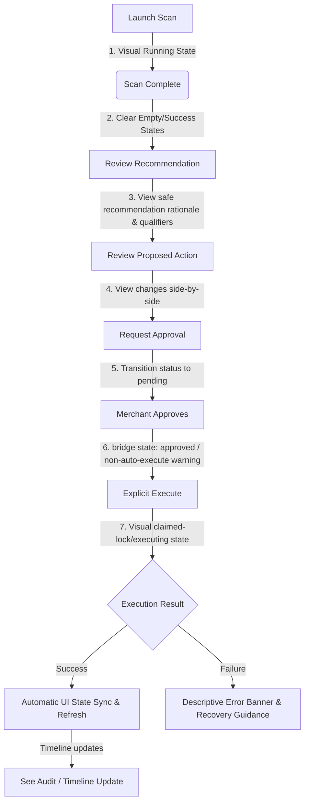
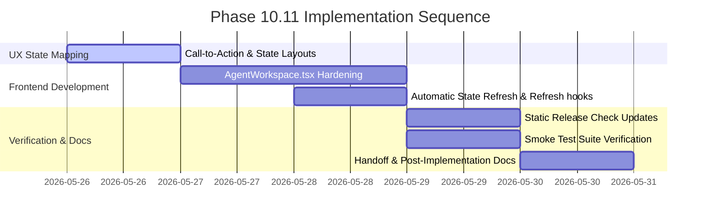

# Implementation Plan — Phase 10.11: MVP End-to-End Merchant Workflow Hardening

This phase focuses strictly on **MVP End-to-End Merchant Workflow Hardening** inside the Softify multi-agent workspace. It does not introduce new features, bulk operations, or expand the product mutation scope. Instead, it systematically refines the user experience, reliability, and error resilience of the core Shopify optimization pipeline, ensuring it is fully stable and pilot-ready.

---

## User Review Required

> [!IMPORTANT]
> **Preservation of Strictly Manual Scopes & Core Guardrails**:
> - **Explicit Manual Execution**: Auto-execution remains strictly prohibited. Approved proposals must wait for explicit merchant-triggered execution dispatches.
> - **Capped Mutation Scope**: Edits remain strictly capped to approved text fields: `title`, `vendor`, `productType`, `status`, and `tags`.
> - **No Bulk Operations**: Batch approvals, batch execution, batch dismissals, and batch request-approvals are out-of-scope and deferred.
> - Theme scopes (`write_themes` / `read_themes`) and theme tools remain completely disabled.

> [!WARNING]
> **Tenant Context Safety**:
> - All workspace fetches must securely propagate normalized tenant contexts (the `shop` query param or verified `organizationId`) to guarantee strict security isolation inside embedded Shopify admin frames.

---

## Open Questions

- **Should the frontend trigger background data synchronization post-execution?**
  - *Proposed Decision*: **Yes, for local Softify state only.** Upon receiving a successful `APPLIED` execution response, the frontend workspace component should automatically trigger a background refresh of Softify workspace data, analytics, timeline, and visible counts. The frontend **must not** directly trigger Shopify mutations or bypass the existing execution pipeline. Any catalog snapshot refresh (meaning the sync of product snapshots from live Shopify to Firestore) must remain strictly inside the existing approved backend execution flow (which is already executed asynchronously by the backend executor service upon successful GraphQL mutation application).

---

## Proposed Changes

### 1. Current Workflow Assessment

#### Today's Core Loop
- **Step 1 (Scan)**: Merchant selects an agent and launches a diagnostic scan (`POST /api/agent-runs`).
- **Step 2 (Insight)**: The agent runs in a sandbox and generates recommendations and proposed draft actions.
- **Step 3 (Bridge)**: Merchant reviews the proposed action changes and clicks "Request Merchant Approval" (`POST /api/proposed-actions/:id/request-approval`), which bridges the action to a PENDING merchant approval request.
- **Step 4 (Decision)**: In the approvals view, the merchant decides (`POST /api/approvals/:id/decide`) to `APPROVE` or `REJECT` the change.
- **Step 5 (Execution)**: If approved, the merchant manually triggers execution (`POST /api/approvals/:id/execute`), which safely mutates the product via Shopify GraphQL and logs the audit event.
- **Step 6 (Audit & Analytics)**: The timeline feed maps the completed audit event, and analytics update metrics accordingly.

#### Fragmented / Brittle Areas (MVP Pain Points)
1. **Placeholder Empty States**: When no agent runs have occurred, dashboard lists and trends charts show bare or unguided boxes.
2. **Missing Loading Indicators**: Launching a scan prints telemetry text, but does not block inputs visually or display skeleton grids for incoming assets.
3. **Execution State Lag**: Finalizing product execution changes the database, but the local workspace views (Recommendations, Proposed Actions, and Analytics summaries) do not automatically re-fetch, leading to stale lists until manual reload.
4. **Error & Recovery Clarity**: If execution is blocked (e.g. store disconnected, missing `write_products` scope), the system throws a raw text error without merchant-friendly guidelines or clear action paths.

---

### 2. End-to-End Workflow Hardening (Visual & Operational Clarity)

We will modify `src/components/AgentWorkspace.tsx` and routing hooks to implement the following structural state refinements:

#### A. Run Agent State Clarity
- Add a prominent visual spinner overlay and disabled state across the selection panel while `isRunning` is true.
- Clear the active log console when a new run is launched to prevent confusion from past scans.

#### B. Recommendation Review Clarity
- Enhance recommendation cards with clear impact badges (`HIGH` -> Indigo, `MEDIUM` -> Amber, `LOW` -> Slate) and distinct bulleted guidelines.
- Highlight the agent source and confidence scores with visual progress bars.

#### C. Proposed Action Review Clarity
- The proposed action review must show only sanitized, allowlisted Before/After fields: `title`, `vendor`, `productType`, `status`, and `tags`.
- Under no circumstances does the frontend render raw proposed action JSON, raw tool arguments, raw Shopify payloads, raw provider output, or internal metadata.
- Add an optimization safe recommendation rationale badge explaining exactly what Shopify attribute is being modified.

#### D. Request Approval Flow Clarity
- Transform the "Request Merchant Approval" action button into a clear, high-contrast primary CTA.
- Display a real-time loading state inside the action button while the bridge handshake is pending.

#### E. Approve/Reject State Clarity
- In the merchant approvals panel, provide warning cards explaining that approvals are *state-only* and require explicit execution to modify the Shopify store.

#### F. Explicit Execution Flow Clarity
- When execution begins, display the transition states clearly on the card (`APPROVED` -> `CLAIMED/EXECUTING` -> `APPLIED` / `FAILED`).
- Disable the "Execute" button immediately to prevent double-submission or concurrency claims conflicts.

#### G. Execution Success/Failure State Clarity
- If execution fails (e.g., due to field validation errors, API limits, or scope blocks), display a descriptive, user-friendly error card rather than raw system error strings.
- Provide a direct recovery pathway link (e.g., "Reconnect Store" or "Verify Installation Permissions") depending on the failure code.

#### H. Audit, Timeline, and Analytics Sync
- **Dynamic Local State-Sync**: Upon a successful execution resulting in `APPLIED`, the frontend will trigger a background data refresh to update the local Softify workspace data, analytics, timeline, and visible counts.
- **Execution Pipeline Integrity**: The frontend must not directly trigger Shopify mutations, catalog sync mutations, or bypass the existing execution pipeline. All catalog snapshot refreshes from Shopify remain strictly inside the approved backend execution flow.

---

### 3. UX Hardening (Visual polish)

1. **Guidance Empty States**: Replace standard "no data" placeholders with action-oriented guidelines (e.g. *"Your product catalog has not been scanned yet. Select the Product Intelligence Agent above to inspect metadata completeness."*).
2. **Skeleton & Spinner Indicators**: Implement skeleton loading placeholders for dashboard graphs, summaries, and timeline steppers while analytical queries are resolving.
3. **Call-to-Action (CTA) Hierarchy**: Standardize button coloring:
   - Primary Action (Launch Scan, Request Approval, Execute): Indigo background with high contrast.
   - Secondary Action (Select Agent, Dismiss Recommendation, Reset Recovery): Outline borders or slate tones.
4. **Tooltips & Safety Banners**: Add a top workspace banner highlighting: *"Sandboxed Environment: Workspace agents suggest changes for your review. No mutations are ever written to your live store without explicit merchant approval and execution."*

---

### 4. Reliability & Context Hardening

1. **Query Context Safety**: Assert that `shopQuery` (which captures the embedded active Shopify shop domain safely) is passed consistently in every single endpoint fetch inside `AgentWorkspace.tsx` to prevent token or session expiration context drops.
2. **Locked State Recoveries**: Phase 10.11 may improve recovery visibility in the UI (e.g., displaying error details and making recovery actions more accessible to operators). However, this phase **must not** introduce any new recovery endpoints unless separately reviewed. Existing recovery endpoints (such as `POST /api/approvals/:id/reset-failed` and `POST /api/approvals/:id/mark-execution-failed`) must remain strictly state-only and must never call Shopify APIs.

---

### 5. Security & Guardrails Verification

We explicitly reaffirm and preserve the following authoritative security constraints:
- **Zero Direct AI Paths**: No LLM provider completes mutations or tool execution directly.
- **Manual Gateways**: The SDK Tool Gateway is the only boundary, and all proposals must pass through merchant approvals.
- **No Token Exposure**: No raw Shopify keys, tokens, prompts, raw recommendation rationale, or secret variables are ever serialized, returned, or logged.
- **Strict Tenant Isolation**: Mismatched request headers are blocked at the route boundary and return a standard `403 Forbidden` response.
- **State-Only Recovery**: Recovery routes (`/reset-failed` and `/mark-execution-failed`) operate strictly on local Firestore states and do not interface with live Shopify APIs.

---

### 6. Explicit Non-Goals
This phase will **not** implement:
- Bulk/batch approvals or batch executions.
- Batch dismissals or batch request-approvals.
- Auto-execution on approval.
- Theme tools or theme write scopes.
- Price, variant, inventory, media, or description mutations.

---

## Proposed Verification Plan

### Automated Tests

#### 1. Release Checks (`scripts/release-check.mjs`)
Extend pre-deployment checks with static assertions verifying:
- Presence of Phase 10.11 documentation files.
- Absence of batch mutations, bulk execution verbs, or auto-execute configurations.
- Absence of theme-related capabilities or unallowlisted scopes.
- Assertion that workspace UI instructions explicitly use manual execution terminology.

#### 2. Smoke Tests (`scripts/smoke-test.mjs`)
Ensure Test T validates the stabilized end-to-end loop:
- Launching diagnostic scan succeeds.
- Generating recommendations and drafting proposed actions.
- Bridging draft actions to pending approvals.
- Final decisions (Approve/Reject) are recorded safely.
- Explicit execution uses the existing approved execution endpoint (`POST /api/approvals/:id/execute`) and the existing safe Shopify GraphQL mutation pipeline (`productUpdate` via `shopify-admin-client.service.ts`). No new Shopify mutation path or custom GraphQL mutation is introduced.
- Cross-tenant requests securely return HTTP 403.
- All non-GET analytics endpoints return HTTP 405.

---

## Implementation Sequencing

### Phase Sequencing

#### Step 1: Frontend UX Hardening in `AgentWorkspace.tsx`
- Refactor the component to implement rich empty states, spinner loader masks during diagnostic runs, and styled impact badges.
- Replace the raw JSON changes view with a clear side-by-side comparison block showing only sanitized, allowlisted Before/After fields (`title`, `vendor`, `productType`, `status`, `tags`).

#### Step 2: Dynamic State Refresh Integration
- Wire the approval execution response inside `AgentWorkspace.tsx` to immediately trigger the re-fetch routines `fetchCatalogAndWorkspaceData()` and `onRefreshStats()` upon successful execution (`APPLIED`).
- Wire the decision responses (Approve/Reject) and bridge requests to immediately synchronize active counts.

#### Step 3: Strengthening Static Checks and Smoke Tests
- Update `scripts/release-check.mjs` to add Test 55 checking Phase 10.11 workflow parameters.
- Verify that smoke tests assert the complete manual loop successfully.

#### Step 4: Write Post-Implementation Documentation
Create/update Walkthrough, Review Notes, Verification, State & Prompt handoffs, and Phase Index files.
