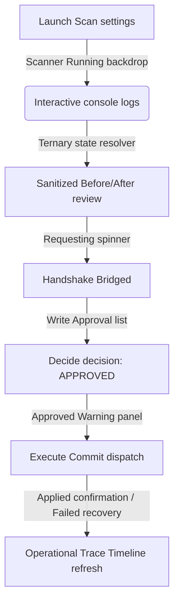

# Phase 10.11 Walkthrough — MVP End-to-End Merchant Workflow Hardening

This document summarizes the changes, visual enhancements, and security validation results implemented during Phase 10.11.

---

## What was Accomplished

We systematically hardened the end-to-end multi-agent workflow in the Softify workspace to deliver a fully reliable, robust, and merchant-friendly manual pilot/demo experience.

### 1. Hardened Frontend UX States (`src/components/AgentWorkspace.tsx`)
- **Action-Oriented Onboarding Empty States**: Replaced default plain text loaders with rich, guided onboarding panels explaining how to select and trigger agent runs if no alerts/actions are present.
- **Launcher Panel Spinner Overlay**: Implemented a visual backdrop-blur loading mask blocking controls while the diagnostic scan (`isRunning`) is active.
- **Log Console Telemetry Reset**: Guaranteed that starting a diagnostic run resets past scan telemetry lines.
- **High-Contrast Impact Badges**: Designed beautiful indigo/amber/slate category labels for HIGH/MEDIUM/LOW recommendations with confidence bar badges.
- **Strictly Sanitized Before/After Proposed Action Comparisons**: Completely removed the raw JSON stringify pre block. Built a human-friendly grid displaying **only** allowlisted changes (`title`, `vendor`, `productType`, `status`, and `tags`) side-by-side, securely filtering internal parameters or payloads.
- **Request Approval Handshake Loading State**: Integrated a spinner inside the "Request Merchant Approval" CTA while bridging draft actions.
- **Workspace Sandboxed Security Banner**: Displayed a premium top sandboxing notice detailing Softify's explicit merchant approval and execution model.

### 2. Manual Execution & Operator Recovery Queue (`src/components/ApprovalQueue.tsx`)
- **Explicit Execution Pipeline CTA**: Added a primary high-contrast `"Execute Commit to Shopify"` action button on approved requests, explaining that approvals are state-only and require explicit dispatches.
- **Pulsing Executing Lock State**: Displayed active spinner loading masks and concurrency locking messages while mutations are in-flight.
- **Committed Confirmation Panel**: Rendered emerald success banners highlighting final storefront committed results.
- **Friendly Operator Recovery Guidance**: Created dedicated error panels for failures describing scope restrictions (e.g. `write_products`), STORE credential disconnects, or locked conflicts.
- **Dynamic State Restoration**: Embedded a `"Reset Failed Status"` CTA invoking the state-only `/reset-failed` recovery route to retry failed executions.
- **Active Selection Synchronization**: Upgraded component item management from stateful cache objects to dynamic ID matching, making sure status changes immediately propagate in the UI.

### 3. Verification & Compliance Security
- **Consistent Tenant Context**: Validated that `shopQuery` (`shop` domain param) is propagated securely on all workspace fetches.
- **Test 55 Pre-deployment Release Checks**: Extended `scripts/release-check.mjs` verifying the manual loop, documentation paths, and absence of batch operations.
- **27/27 Passing Smoke Tests**: Verified the manual MVP loop (Diagnostics -> Run Scan -> Propose Update -> Request Approval -> Final Decision -> Manual Execution -> Audit Timeline trace log) synchronously.

---

## Walkthrough Visual Progression



### Allowlisted Comparisons Grid Shape
```
  [ TITLE ]
  - BEFORE: Status: Sync storefront snap properties
  + AFTER : Eco Linen Warm Shirt (Revised)
```

---

## Test Results

### 1. Static Verification Checks (`scripts/release-check.mjs`)
Running `node scripts/release-check.mjs` verifies **55/55** tests successfully:
```bash
Verifying: 55. Phase 10.11 MVP End-to-End Merchant Workflow Hardening static validation...
✓ PASS

Results: 55 passed, 0 failed, total 55
RELEASE VERIFICATION PASSED SUCCESSFULLY!
```

### 2. E2E Dynamic Smoke Tests (`scripts/smoke-test.mjs`)
Running `node scripts/smoke-test.mjs` verifies **27/27** checks successfully:
```bash
Running: P. Safe Approved Product Mutation Execution validation...
   [EXECUTION TESTS] Verified successful execution, tenant rejections, claim locks, and audit events.
✓ PASS

Results: 27 passed, 0 failed, total 27
SMOKE TEST COMPLETED SUCCESSFULLY!
```
