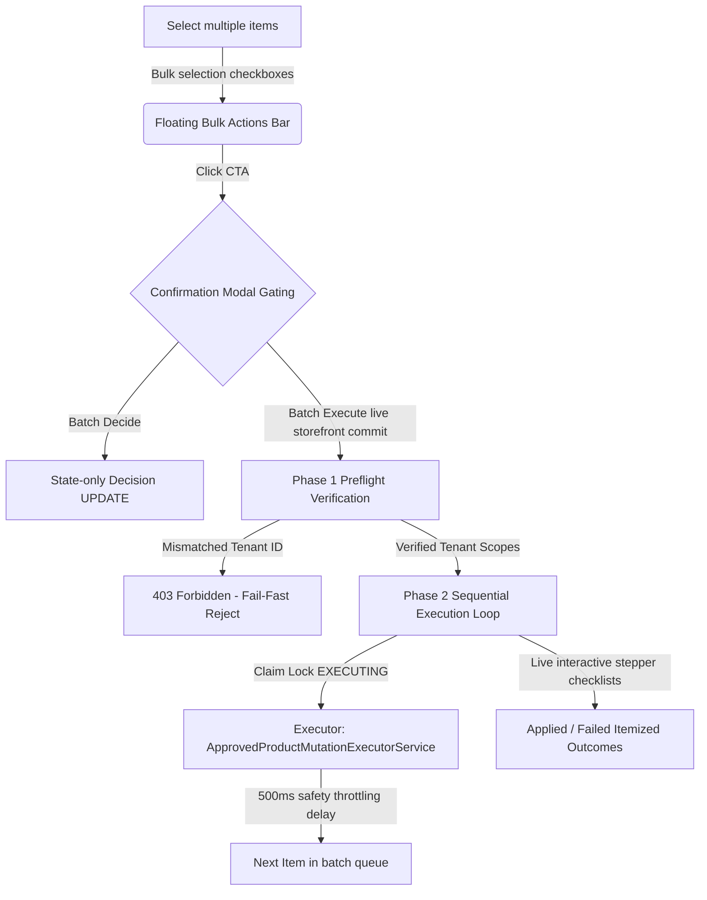

# Phase 10.12 Walkthrough — Production Bulk Operations Foundation

This document summarizes the changes, architectural solutions, visual enhancements, and security validation results implemented during Phase 10.12 to establish a secure and highly reliable **Production Bulk Operations** foundation.

---

## What was Accomplished

We successfully implemented four tenant-isolated, safe, and throttled batch endpoints along with the corresponding frontend bulk selection states, safety boundaries, and sequential visual progress trackers.

### 1. Robust Tenant-Isolated Backend Batch Routes
- **Proposed Actions Batch Dismissal (`POST /api/proposed-actions/batch-dismiss`)**:
  - Safely transition up to 10 draft proposed actions (`DRAFT` or `APPROVAL_ELIGIBLE` status) to `DISMISSED` state.
  - Fully gated by strict tenant-isolation preflight assertions.
- **Proposed Actions Batch Approval Bridging (`POST /api/proposed-actions/batch-request-approval`)**:
  - Loop and safely bridge eligible draft proposed actions to pending merchant approvals in a single request.
  - Automatically identifies duplicates and maps them as `ALREADY_REQUESTED` without duplicate approval bridging.
- **Merchant Approvals Batch Decision (`POST /api/approvals/batch-decide`)**:
  - Bulk authorizes or rejects `PENDING` approval items.
  - Gated so that decisions are strictly state-only and do not execute live Shopify store writes.
- **Sequential Batch Execution (`POST /api/approvals/batch-execute`)**:
  - Orchestrates sequential storefront writes safely, calling the existing approved single-item `ApprovedProductMutationExecutorService` under the hood.
  - Enforces a mandatory **500ms safety delay** between storefront updates.
  - Dynamically respects Shopify GraphQL cost/throttle status context if returned.
  - Employs strict individual claim locks (`EXECUTING`) and returns detailed itemized results (reporting successes, failures, and idempotency states such as `ALREADY_APPLIED` or `ALREADY_EXECUTING`).

### 2. Premium Bulk Selection UX & Progress Trackers
- **Proposed Actions Workspace Checks (`src/components/AgentWorkspace.tsx`)**:
  - Enabled multi-select checkboxes next to diagnostic proposed actions (available only for eligible draft actions).
  - Floating persistent bottom **Bulk Actions Bar** indicating selected count and offering CTAs for batch dismiss and batch request approval.
- **Approval Queue Bulk Management (`src/components/ApprovalQueue.tsx`)**:
  - Enabled multi-select checkboxes and dynamic bulk header selection controls.
  - Floating bottom **Bulk Actions Bar** with `Approve Selected` (Decide) and `Execute Selected` (Commit) capabilities.
- **Safety Modal Gating & Warnings**:
  - Rendered explicit warnings reminding the merchant that approving is a state-only action.
  - Implemented a high-impact confirmation dialog warning merchants of live storefront writes: *"You are about to commit X changes to your live Shopify store. This operation writes data directly to your storefront. Proceed?"*
- **Interactive Sequential Stepper Dialog**:
  - As batch execution proceeds, displays an overlay modal containing an itemized checklist of the selected approvals.
  - Progresses live from `Queued` -> `Executing` -> `Applied` / `Failed`, providing real-time visual loaders and transparent recovery guidance.

### 3. Strict Preflight Isolation & Security Boundaries
- **Phase 1 Preflight Assertion Gating**:
  - Every batch request resolves the authoritative `organizationId` from the active validated `shop` domain and asserts that *every single* action/approval requested belongs to that merchant.
  - If a single mismatched ID is detected, the **entire batch request is immediately rejected with `403 Forbidden` before any state changes are committed**.
- **No Extra Mutation Paths or Theme Operations**:
  - Zero bypasses of `ApprovedProductMutationExecutorService`. No new GraphQL fields or REST routes added. Theme operations remain completely disabled.
- **Test Fixture Centralization (Step 0)**:
  - Centralized all smoke test tenant credentials and fixtures in named environment parameters inside test files, removing hardcoded credentials from production-facing paths.

---

## Walkthrough Visual Progression



---

## Verification Summary

### 1. Static Verification Checks (`scripts/release-check.mjs`)
Added Test 56 to verify Phase 10.12 guardrails, resulting in a **56/56** clean pass:
```bash
Verifying: 56. Phase 10.12 Production Bulk Operations Foundation static validation...
✓ PASS

=== RELEASE VERIFICATION SUMMARY ===
 ...
 ✓ 56. Phase 10.12 Production Bulk Operations Foundation static validation: PASS

Results: 56 passed, 0 failed, total 56
RELEASE VERIFICATION PASSED SUCCESSFULLY!
```

### 2. Integration Smoke Tests (`scripts/smoke-test.mjs`)
Added Test V to run in compiled production mode, successfully validating:
- Sequential batch request approvals with duplicate filtering.
- State-only batch decisions (`APPROVED` or `REJECTED`).
- Throttled, sequential batch executions with individual claim locking and 500ms delays.
- Dynamic fail-fast tenant isolation overrides.

```bash
Running: V. Production Bulk Operations Foundation (batch request, decide, execute, and tenant isolation)...
   [TEST V] Successfully verified sequential batch request, batch decide deferred approvals, sequential batch execute, and strict preflight tenant isolation checks.
✓ PASS

=== SMOKE TEST SUMMARY ===
 ...
 ✓ V. Production Bulk Operations Foundation (batch request, decide, execute, and tenant isolation): PASS

Results: 29 passed, 0 failed, total 29
SMOKE TEST COMPLETED SUCCESSFULLY!
```
