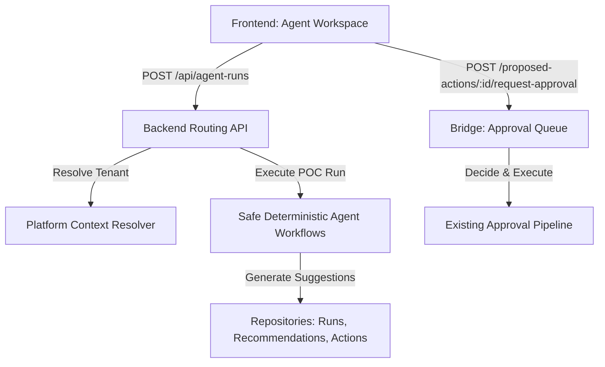

# Implementation Plan — Phase 10.9: Multi-Agent Product Workspace Foundation

This phase introduces Softify's first **Multi-Agent Product Workspace** layer, enabling merchants to see available catalog agents, review their scopes/risk levels, execute secure tenant-scoped runs, review active diagnostic recommendations, inspect proposed draft updates, and safely bridge updates to the existing approvals queue without expanding dangerous mutation capabilities.

---

## User Review Required

> [!IMPORTANT]
> **Tool Execution & Mutation Boundaries**:
> - Agents **do not execute mutations directly**. AI providers only analyze and output suggestions.
> - The **Tool Gateway** remains the absolute execution boundary.
> - Product mutations proposed by agents (Content Agent, Product Intelligence Agent) are drafted as **Proposed Actions** with `status: 'DRAFT'`.
> - Merchants must explicitly trigger a "Request Approval" POST action, which maps the draft payload directly to the pre-existing, hardened approvals queue as a `PENDING` request, preserving all Phase 10.8 security controls.
> - Mutation field scope is strictly limited to the allowlisted fields: `title`, `vendor`, `productType`, `status`, and `tags`.
> - **Zero theme writes**, visual changes, price alterations, or variant updates are allowed.

> [!WARNING]
> **Data Scoping & Retention Boundaries**:
> - No raw Shopify API responses, raw prompt strings, raw tool arguments, secrets, tokens, or PII will be persisted in Firestore or memory fallbacks.
> - Agent runs store only sanitized telemetry, run statuses, duration, and metadata.

---

## Open Questions

- Should agent runs be stored locally in memory or Firestore?
  - **Proposed Answer**: Dynamically resolved. When Firestore is configured, runs, recommendations, and proposed actions persist in dedicated database collections; otherwise, they default to safe, isolated in-memory registry maps.

---

## Proposed Changes



### Component 1: Data Contracts & Persistence Layer (Repositories)

We introduce three new domain records and their repository contracts under the existing provider model.

#### [NEW] [agent-run.repository.contract.ts](file:///c:/Projects/softify/softify/src/server/repositories/contracts/agent-run.repository.contract.ts)
Defines the structure and queries for tracking agent invocation sessions.
- **`AgentRun` Schema**:
  ```typescript
  export interface AgentRun {
    id: string;
    organizationId: string;
    storeConnectionId: string;
    agentId: string;
    startedAt: string;
    completedAt?: string;
    status: 'RUNNING' | 'COMPLETED' | 'FAILED';
    error?: string;
    logs: string[]; // Sanitized procedural milestones (e.g. "Reviewing title compliance...")
    recommendationsCount: number;
    proposedActionsCount: number;
  }
  ```

#### [NEW] [recommendation.repository.contract.ts](file:///c:/Projects/softify/softify/src/server/repositories/contracts/recommendation.repository.contract.ts)
Defines rules for merchant-facing diagnostic warnings.
- **`Recommendation` Schema**:
  ```typescript
  export interface Recommendation {
    id: string;
    organizationId: string;
    storeConnectionId: string;
    agentRunId: string;
    agentId: string;
    title: string;
    description: string;
    severity: 'info' | 'warning' | 'critical';
    dismissed: boolean;
    dismissedAt?: string;
    dismissedBy?: string;
    createdAt: string;
  }
  ```

#### [NEW] [proposed-action.repository.contract.ts](file:///c:/Projects/softify/softify/src/server/repositories/contracts/proposed-action.repository.contract.ts)
Defines rules for draft metadata modifications.
- **`ProposedAction` Schema**:
  ```typescript
  export interface ProposedAction {
    id: string;
    organizationId: string;
    storeConnectionId: string;
    agentRunId: string;
    agentId: string;
    targetType: 'PRODUCT';
    targetId: string; // Shopify Product GID
    title: string;
    description: string;
    changes: {
      title?: string;
      vendor?: string;
      productType?: string;
      status?: string;
      tags?: string[];
    };
    status: 'DRAFT' | 'APPROVAL_REQUESTED' | 'APPROVED' | 'DISMISSED';
    approvalRequestId?: string;
    dismissedAt?: string;
    dismissedBy?: string;
    createdAt: string;
  }
  ```

#### [NEW] [in-memory-agent-run.repository.ts](file:///c:/Projects/softify/softify/src/server/repositories/in-memory/in-memory-agent-run.repository.ts)
#### [NEW] [in-memory-recommendation.repository.ts](file:///c:/Projects/softify/softify/src/server/repositories/in-memory/in-memory-recommendation.repository.ts)
#### [NEW] [in-memory-proposed-action.repository.ts](file:///c:/Projects/softify/softify/src/server/repositories/in-memory/in-memory-proposed-action.repository.ts)
- Safe, sandboxed in-memory maps implementing the contracts with isolated tenant filtering.

#### [NEW] [firestore-agent-run.repository.ts](file:///c:/Projects/softify/softify/src/server/repositories/firestore/firestore-agent-run.repository.ts)
#### [NEW] [firestore-recommendation.repository.ts](file:///c:/Projects/softify/softify/src/server/repositories/firestore/firestore-recommendation.repository.ts)
#### [NEW] [firestore-proposed-action.repository.ts](file:///c:/Projects/softify/softify/src/server/repositories/firestore/firestore-proposed-action.repository.ts)
- Persistent collections (`agent_runs`, `recommendations`, `proposed_actions`) using Google Cloud Firestore, verifying tenant ownership on write.

#### [MODIFY] [repository-provider.ts](file:///c:/Projects/softify/softify/src/server/repositories/repository-provider.ts)
- Register and wire the three new repositories under `getRepositories()` to auto-resolve InMemory vs Firestore environments.

---

### Component 2: Multi-Agent Workspace Routing API

We introduce standard, tenant-scoped routes mapped under the pre-existing context resolver framework.

#### [MODIFY] [agents.routes.ts](file:///c:/Projects/softify/softify/src/server/routes/agents.routes.ts)
- Mount `GET /api/agents/catalog` listing the 4 available agents, their required scopes, risk levels, and descriptions.
- Mount **POST /api/agent-runs**, **GET /api/agent-runs**, and **GET /api/agent-runs/:id** using the context resolver to isolate runs.

#### [NEW] [recommendations.routes.ts](file:///c:/Projects/softify/softify/src/server/routes/recommendations.routes.ts)
- Mount `GET /api/recommendations` and `POST /api/recommendations/:id/dismiss`.

#### [NEW] [proposed-actions.routes.ts](file:///c:/Projects/softify/softify/src/server/routes/proposed-actions.routes.ts)
- Mount `GET /api/proposed-actions`, `POST /api/proposed-actions/:id/dismiss`, and `POST /api/proposed-actions/:id/request-approval`.
- **Approval Bridging Pipeline**:
  - `POST /api/proposed-actions/:id/request-approval` loads the proposed action, asserts tenant matching, updates the action's status to `APPROVAL_REQUESTED`, and calls `repos.approvals.createApprovalRequest(...)` to seamlessly bridge the draft changes to the global merchant approvals queue.

#### [MODIFY] [app.ts](file:///c:/Projects/softify/softify/src/server/app.ts)
- Mount the new routes under `/api` properly.

---

### Component 3: Safe Deterministic Agent POC Workflows

To guarantee safety and performance, we implement deterministic POC runs for each agent type:

| Agent Type | Required Scopes | Risk Level | Execution Outputs |
| :--- | :--- | :--- | :--- |
| **Product Intelligence Agent** | `read_products` | Low | Generates diagnostic warnings (e.g. missing tags, missing vendor names) and proposes meta cleanup drafts. |
| **SEO / AEO Agent** | `read_products` | Low | Outputs search keywords & semantic structure compliance recommendations-only. Zero mutations or proposed writes. |
| **Content Agent** | `read_products` | Low | Analyzes titles/descriptions and drafts optimized titles/tags as approval-eligible Proposed Actions. No `descriptionHtml` writes. |
| **Design Review Agent** | `read_themes` | High | Recommends storefront layout alignment fixes. No theme writes, no theme tools, no `write_themes` scope. |

---

### Component 4: Unified Admin Workspace Frontend UI

We introduce a premium, visual workspace dashboard that productizes the multi-agent layers.

#### [NEW] [AgentWorkspace.tsx](file:///c:/Projects/softify/softify/src/components/AgentWorkspace.tsx)
A premium, glassmorphic layout displaying:
- **Registry Catalog Grid**: Modular card cards detailing each agent's description, required scopes, risk badges, and a "Manage Agent Workspace" action.
- **Run Monitor Panel**: Interactive console to launch a "New Workspace Diagnostic Run" with streaming log messages (e.g. "Scanning SEO guidelines...").
- **Recommendations Center**: Responsive info-alert blocks showing active diagnostics with an instant "Dismiss" mechanism.
- **Proposed Actions Inbox**: Grid showing draft product changes. Merchants can click "Request Merchant Approval" to queue the changes, or "Dismiss" to discard.

#### [MODIFY] [App.tsx](file:///c:/Projects/softify/softify/src/App.tsx)
- Embed the `AgentWorkspace` tab into the lateral navigation sidebar.
- Propagate the safe, centralized `buildShopQuery()` parameter to all new workspace requests to prevent tenant lockouts.

---

### Component 5: CI/CD Index Automation & Test Coverages

We resolve Firestore query indexing requirements and automate index deployment in GitHub Actions.

#### [MODIFY] [firestore.indexes.json](file:///c:/Projects/softify/softify/firestore.indexes.json)
Define new composite query indexes:
- Collection: `agent_runs` -> `organizationId` ASC, `startedAt` DESC
- Collection: `agent_runs` -> `organizationId` ASC, `storeConnectionId` ASC, `startedAt` DESC
- Collection: `recommendations` -> `organizationId` ASC, `dismissed` ASC, `createdAt` DESC
- Collection: `proposed_actions` -> `organizationId` ASC, `dismissed` ASC, `createdAt` DESC
- Collection: `proposed_actions` -> `organizationId` ASC, `status` ASC, `createdAt` DESC

#### [MODIFY] [deploy-cloud-run.yml](file:///c:/Projects/softify/softify/.github/workflows/deploy-cloud-run.yml)
- Automate Firestore index deployment after authentication and before deployment:
  ```yaml
        - name: Deploy Firestore Composite Indexes
          run: |
            echo "Deploying Firestore composite indexes..."
            gcloud firestore indexes import firestore.indexes.json --project="${{ secrets.GCP_PROJECT_ID }}" --database="softify"
  ```

---

## Verification Plan

### Automated Tests

#### 1. Static Release Coverages (`release-check.mjs`)
Add validations verifying:
- The 4 agents exist in catalog.
- No `write_themes` is registered.
- Mismatched tenant contexts return HTTP 403.
- Under no circumstances does the server expose raw prompts, secrets, or raw Shopify responses.

#### 2. Integration Smoke Suite (`smoke-test.mjs`)
Extend the smoke tests with Test S:
- `GET /api/agents/catalog` returns 200.
- `POST /api/agent-runs` initializes a secure run session and resolves `shop` parameters cleanly.
- `GET /api/recommendations` and `GET /api/proposed-actions` retrieve items mapped to the shop.
- Assert mismatched shop + organizationId yields HTTP 403.
- Assert missing parameters yields HTTP 400.

### Manual Verification
- Run local server CJS bundle and review that the Workspace navigation tab displays the agent catalog grid cleanly.
- Trigger diagnostic runs and confirm that the recommendations are dismissed immediately.
- Confirm draft proposals correctly populate the approvals queue.
