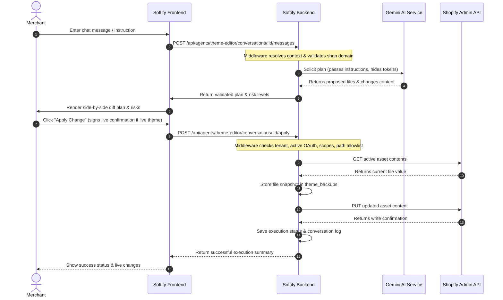

# Implementation Plan — Phase 11.0: Simplified Merchant UI & Theme Editor AI Agent MVP

This document outlines the Product Pivot, Technical Architecture, Security Model, Verification Plan, and Acceptance Criteria for **Phase 11.0 — Simplified Merchant UI & Theme Editor AI Agent MVP**.

---

## 1. Product Direction Pivot Summary

Softify is simplifying its merchant-facing SaaS control center around a single primary experience:
- **Theme Editor AI Agent**: A Shopify, Liquid, and JavaScript expert agent designed to help merchants edit and improve their storefront themes safely.
- **Simplified Navigation**: All other non-essential modules (Store Dashboard, product SEO agents, workspace analytics, raw tool gateways, etc.) will be hidden from the main merchant navigation bar. The sidebar will only show **Settings** and **Your Team** (which lists only enabled agents, currently only the **Theme Editor AI Agent**).
- **Theme Read/Write Permissions**: We are introducing `read_themes` and `write_themes` scopes for the connected Shopify store specifically to power theme editing. Unrelated write scopes (e.g. `write_products`, `write_customers`) remain strictly blocked.

---

## 2. Reuse Existing Softify Infrastructure

To ensure a highly maintainable, cohesive, and architecturally robust system, we commit to the following reuse constraints:
- **No Parallel Framework**: We will not build a separate, parallel, or ad-hoc agent framework. The implementation will fully adapt and extend the existing Softify agent catalog, agent runtime boundary, Tool Gateway concepts, Firestore repositories, store connection models, OAuth flow, and existing route/service architecture.
- **Extensible Agent Registry**: The Theme Editor AI Agent must be registered as a new agent definition (`theme_editor_ai_agent`) inside the existing agent catalog model. This prevents hardcoding the Theme Editor AI Agent in a way that would block adding future agents.
- **Preserved Existing Agents**: Existing catalog agents (`agent_catalog_health`, `agent_product_seo`, etc.) must not be physically deleted. They will be hidden from public merchant navigation and Settings selection for this phase, remaining fully intact in the backend code and tests.
- **State-Driven "Your Team" Navigation**: The "Your Team" sidebar list must be driven dynamically by the persisted enabled-agent state from `agent_installations` (generic model keyed by `agentId`), not by hardcoded frontend UI values.
- **Generic Settings Configuration**: Setting an agent to enabled or disabled must use the generic Softify `agent_installations` collection/repository, keyed on `agentId`.
- **Generic Conversation Persistence**: Chat history, message records, and conversation persistence must be generic and keyed by `agentId` in Firestore or the repository layer, ensuring future agents can seamlessly reuse the same conversation model.
- **Extensible AI Provider Abstraction**: The AI provider configuration must support Gemini as the initial engine while remaining extensible to future models or providers.

---

## 3. Security & Safety Model (Controlled Backend Boundaries)

To protect the Shopify store from reckless or malformed AI writes, we enforce a strict **Safe Execution Boundary**:
- **No Direct AI-to-Shopify Path**: The AI provider (Gemini) never receives Shopify access tokens, credentials, or direct Shopify write endpoints.
- **Controlled Backend Theme Service**: The AI provider only proposes plans. All theme reads, writes, and modifications are handled by a dedicated, authenticated, tenant-isolated backend service on the Softify server.
- **Confirmation before Apply**: The Theme Editor AI Agent will generate a clear diff plan showing what files will change, what is changing, and why. The merchant must explicitly click **"Apply Change"** on the frontend before any theme write is dispatched.
- **Strict File Allowlist & Path Validation**:
  - Only assets inside the Shopify theme asset structure (e.g., `layout/`, `templates/`, `sections/`, `snippets/`, `assets/`, `config/`) are eligible.
  - Reject absolute paths, hidden/system files, and any path traversal patterns (e.g., containing `..`).
- **Durable Backup Before Write**: Before updating any theme asset file, the backend service must:
  1. Fetch the active asset's current contents from the live store.
  2. Write a durable snapshot backup to the database (Firestore `theme_backups` collection or repository).
  3. Log the operation ID, timestamp, shop domain, theme ID, file key, old hash, new hash, and operator email.
- **Graceful Fail-Safe Checks**: Operation blocks if any precondition (shop context, active OAuth connection, required scope, selected theme, config status) is missing or invalid.

---

## 4. Design Decisions & Resolution of Open Questions

### A. Default Target Theme Selection Policy
- **Target Preference**: The Theme Editor AI Agent will prefer editing an unpublished or development theme by default where available, protecting the live storefront from experimental writes.
- **Theme Selector UI**: The chat interface and settings screens must include an explicit theme selector to view or change the target theme.
- **Visibility**: The selected target theme must be clearly displayed to the merchant before generating edit plans or applying updates.
- **Live Theme Confirmation Step**: If only the active/live theme is available on the store, the system may allow editing it only after the merchant provides explicit confirmation via a checkbox or modal statement:
  *“I understand this will change my live Shopify theme.”*
- **Theme Target Gates**: If no theme target is selected, or if the target theme state is unknown, all edit planning and execution operations must be strictly blocked.

### B. Secure AI Engine Credentials
- **Gemini Priority**: Gemini is the initial provider.
- **Secure Key Injection**: The Gemini API key must be loaded dynamically on the backend via the `GEMINI_API_KEY` environment variable or Secret Manager.
- **No DB Exposure**: We will not store Gemini API keys in Firestore from any client settings UI in this phase.
- **Zero Frontend Leakage**: Raw Gemini API keys must never be returned by any API endpoint, exposed in the frontend, or written to server telemetry/logs.
- **Settings Indication**: The Settings UI will only return:
  - Provider Name: `gemini`
  - Status: `Configured` or `Not Configured` (based on backend env var check)
  - Active Model: (e.g., `gemini-1.5-flash` or the configured model identifier)
- **Safe Fallback**: If the backend configuration is missing the Gemini API credentials, the Theme Editor Agent chat must fail safely, providing a friendly merchant-facing setup assistance message instead of returning raw error traces.

---

## 5. Deliberate & Limited Scope Expansion

- **Limited Scope**: Theme scopes (`read_themes`, `write_themes`) are introduced strictly for Phase 11.0 and solely for the `theme_editor_ai_agent` context.
- **Isolated Tools**: No other legacy or active catalog agents may receive theme-reading or theme-writing tools.
- **Strict Scope Boundaries**: Do not request or introduce unrelated scopes (e.g., `write_products`, `read_customers`, `write_customers`, inventory, variant, price, media, or variant mutations).
- **Backend Enclosure**: All theme asset writes are confined to protected Softify backend routes running behind authenticated tenant isolation middleware.

---

## 6. Execution Flow

The full transaction loop must operate as follows:

---

## 7. Technical Architecture & Endpoints

### A. Settings API Endpoints
We will expose protected endpoints for onboarding status, agent installations, and AI configuration:
- `GET /api/settings/store-status`: Returns shop domain, connection status, OAuth scopes, and Theme Editor readiness.
- `GET /api/settings/agents`: Lists merchant-facing agents (only `theme_editor_ai_agent` initially) and installation status.
- `PATCH /api/settings/agents/:agentId`: Enables or disables the agent (persisted in `agent_installations`).
- `GET /api/settings/ai-providers`: Exposes configured AI providers (Gemini status only, never leaks secrets/keys).
- `PATCH /api/settings/ai-providers/:providerId`: Updates settings like active model name.

### B. Theme Editor Chat & Planning API Endpoints
- `GET /api/agents/theme-editor/conversations`: Fetch history of conversations.
- `POST /api/agents/theme-editor/conversations`: Start a new conversation.
- `GET /api/agents/theme-editor/conversations/:conversationId`: Fetch messages for a conversation.
- `POST /api/agents/theme-editor/conversations/:conversationId/messages`: Send a message and trigger assistant response.
- `POST /api/agents/theme-editor/conversations/:conversationId/plan`: Solicits the theme edit plan from the AI agent.
- `POST /api/agents/theme-editor/conversations/:conversationId/apply`: Merchant triggers the actual safe theme write.

### C. Backend Theme Tools (Tenant Isolated)
- `GET /api/theme/status`: Resolves connection status and target active theme.
- `GET /api/theme/themes`: Fetches a list of available themes on the store.
- `GET /api/theme/assets?themeId=...`: Lists files in the target theme.
- `GET /api/theme/assets/content?themeId=...&assetKey=...`: Reads contents of a theme file.
- `POST /api/theme/assets/update`: Safely writes/updates a theme file (creates backup first).

---

## 8. Implementation Acceptance Criteria

The phase is complete and accepted only if:
- [ ] **Infrastructure Reuse**: Existing Softify databases, provider models, agent catalogues, and token encryption systems are reused; no separate parallel agent framework is introduced.
- [ ] **Extensible Agent model**: The Theme Editor AI Agent is registered in the static agent definitions list; adding future agents is fully supported by adding a catalog entry.
- [ ] **State-Driven Navigation**: Sidebar lateral "Your Team" displays are entirely driven by the persisted enabled status of registered agents in Settings.
- [ ] **Theme Preference**: Default target theme is a development/unpublished theme where available.
- [ ] **Live Confirmation**: Live theme writes are fully blocked until the merchant explicitly ticks the live storefront warning modal.
- [ ] **Blocked Path Gating**: Path traversals (`..`) and hidden system file edits are strictly validated and blocked at the backend controller level.
- [ ] **Secure Key Storage**: AI Credentials remain environment-based, are never returned in client JSON responses, and never logged in backend output.
- [ ] **Preflight Writes Safety**: Asset backup snapshot records are durably committed to the database before dispatches to Shopify.
- [ ] **Deliberate Scopes**: No unrelated scopes (`write_products`, `read_customers`, etc.) are introduced in this phase.
- [ ] **Build & Tests Green**: All compiler tasks (`npm run lint`), bundle operations (`npm run build`), release check verifications (`npm run verify:release`), and smoke-test runs (`npm run smoke`) complete with 100% success.
